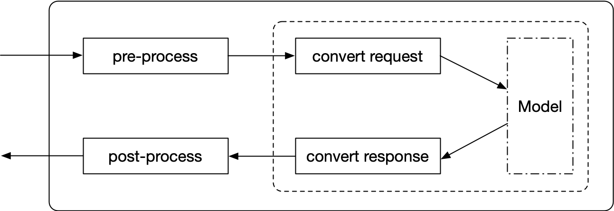

# deliverable_model

设计 DeliverableModel 的目的是最大可能的降低模型部署和使用的难度。寻求让部署变成黑盒操作和开箱即用，最大可能的降低调用者的负担，不需要知道任何实现细节，做端到端的推理，同时也不会对模型生产者构成很大的工作负担。

## 逻辑结构
从模型使用者的角度来说，DeliverableModel 就是一个从可以从磁盘载入的函数。用户只需要使用原生的 Python 数据类型来调用这个函数，就可以得到一个请求结果。使用示例如下：

```python
import deliverable_model as dm

model = dm.load("./deliverable_model_dir")

request = dm.make_request(query=["明天天气如何", "打开收音机"])

result = model.inference(request)

print(result.data)
```

输出：

```text
# TODO, fill me
```

如上面所示，使用者完全不需要知道具体的实现方式和具体依赖信息。DeliverableModel 会在载入模型的时候自动安装模型所依赖的包。同时在调用推理函数（也就是 inference 时），模型会自动完成前置处理、模型推理和后置处理。

DeliverableModel 的内部处理逻辑如下：



为了更加适配毫秒必争的工业环境。DeliverableModel 支持 All in Local 和 Remote Wraper 模式，默认的模式是 All in Local。

在 All in Local 模式下，所有的前置处理、模型推理和后置处理都在本地（同一个进程内）完成。部署起来非常容易，因此非常适合原型测试和演示等对并发性能要求不是很严格的场景。

相比之下，Remote Wraper 模式则提供了更好的并发性能。在 Remote Wraper 模式下，前置处理和后置处理都在本地完成，模型推理则在远程服务器上完成，两者通过 GRPC/HTTP 等 RPC 接口进行通信。由于模型推理部分独立部署，因此用户可以选择使用更加高级的部署方案来获取更加好的处理性能。比如使用 TensorFlow Serving 来充分利用硬件资源并可以启用 batch inference 等特性来最大程度的增加并发处理能力。

## 详细设计

见 [DeliverableModel 设计文档](design/DeliverableModel_arch_design_doc.md)

## Roadmap
将客户端创建/导出 deliverable_model 的代码部分，独立成单独的 SDK 包，这样可以避免 deliverable_model 所依赖的 TensorFlow 等软件的版本和客户的代码出现冲突。
